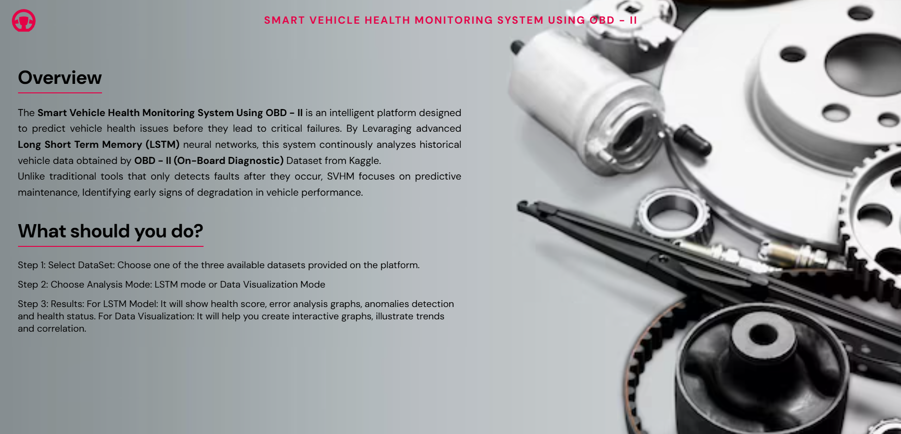
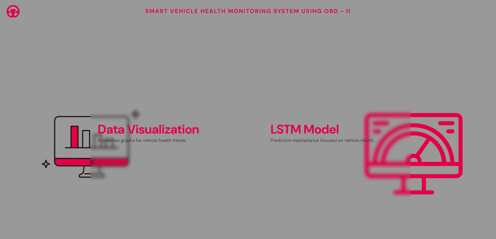

# Smart Vehicle Health Monitoring Using OBD - II 

Overview
-
This is an Smart Analysis Tool designed to predict vehicle health issues before they lead to critical failures. It helps in identifying problems at an early stage so that necessary actions can be taken in time. Unlike basic approaches that only detect faults after they occur, the SVHM system focuses on predictive maintenance. It works by identifying early signs of degradation in vehicle performance, allowing users to prevent failures instead of reacting to them later.

By implementing Long Short-Term Memory (LSTM) neural networks, this system continuously analyzes historical vehicle data obtained from an OBD-II (On-Board Diagnostics II) dataset sourced from Kaggle. OBD-II is a system in vehicles that monitors engine performance and other important components, collecting data from various sensors to detect faults or issues. This data can be accessed using a diagnostic tool, making it useful for analyzing vehicle health and performance. The system processes patterns and trends within this data to better understand vehicle behavior over time, enabling more accurate and reliable predictions related to vehicle health and performance.

LANGUAGES & TOOLS
-


Features 
-
-  Predicts potential vehicle errors.
- Cleans and analyzes historical vehicle telematics.
- Threshold Alerting | Anomaly Detection | Interactive Visualization.
- User-Centric, One-Click Diagnostic Reports.

Dataset Architecture
- 
| Datasets | Scale | Attributes | Primary Focus |
| :--- | :--- | :--- | :--- |
| **Vehicle Telematics** | ~1,700 records | 30 Parameters | Core engine metrics & health patterning |
| **Batch Diagnostics** | ~60,000 records | 14 Vehicles | Mixed models analysis (2003 - 2016) |
| **Driver Behaviour** | ~8,200 records | 20 Drivers | Timing Advance and Fuel trims analysis |
 
Project Structure
-
```text
Project_Vehicle_Monitoring/
├── Project_SVHM/
│   ├── Datasets/
│   │   ├── Vehicle_Telematics.csv
│   │   ├── Multi_Vehicle_Data.csv
│   │   └── Driver_Behaviour.csv
│   ├── Static
│   │   ├── Global.css
│   │   ├── Layout.css
│   │   ├── Main.css
│   │   ├── StylingCards.css
│   │   ├── StylingModelSelection.css
│   │   ├── StylingResults.css
│   │   ├── StylingSection.css
│   │   ├── bgimage.avif
│   │   └── bridge.js
│   ├── Templates/
│   │   ├── Base.html
│   │   ├── Navbar.html
│   │   ├── Section_1.html
│   │   ├── Section_DS.html
│   │   ├── Section_MS.html
│   │   ├── Section_RESULTS.html
│   │   └── Section_RESULTS.htmll
│   ├── Screenshots/
│   │   ├── Model_Selector.png
│   │   ├── Data_Visualizer.png
│   │   └── Overview_Page.png
│   ├── main.py
│   ├── requirements.txt
│   └── README.md
```

How can you use it on your device?
-
1. Clone the Repository
   ```Text
   git clone [https://github.com/Amazingly12/Smart_Vehicle_Health_Monitoring_Using_OBD_II.git](https://github.com/Amazingly12/Smart_Vehicle_Health_Monitoring_Using_OBD_II.git)
   ```
2. Install Dependencies
   ```Text
   pip install requirements.txt
   ```
3. Run the Application
   ```Text
   cd Project_SVHM
   uvicorn main:app --reload
   ```

Screenshots
-



